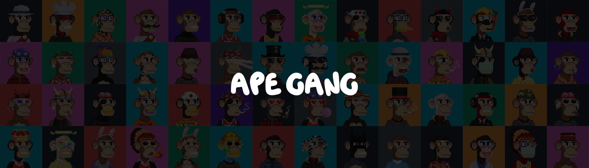

# Ape Gang Wiki

## What is Ape Gang?

### Ape Gang is a collection of 10,000 NFTs on the Ethereum blockchain

Every Ape Gang NFT was algorithmically generated from 156 traits using python.

The art was created using a 50x50 pixel format, a pixel art style which Jokong, the founder and artist is renowned for.

Founded on May 4th 2021

Minted on June 30th 2021

Sold out on July x 2021

