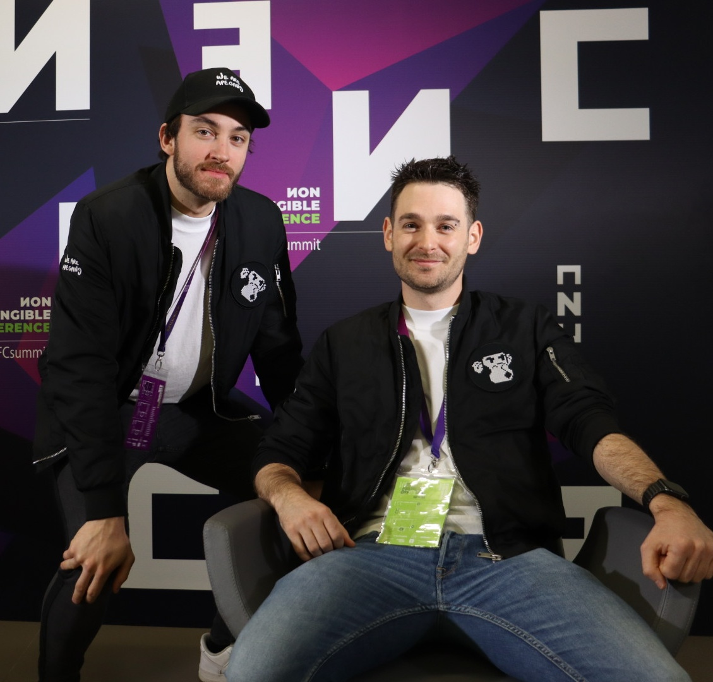

# Founders

Before Ape Gang, Jokong and Rikong were long-time friends, IT students and coders from Lyon, France. Jokong taught IT and Rikong managed his own marketing agency. Both were involved in crypto long before Ape Gang, but only in 2021 did they take their first step into the NFT world.

Noticing the growing trend of NFTs in early 2021 and taking advantage of Jokong's love for pixelized art, the co-founders started Ape Gang.&#x20;

Initially a profile-picture project, they were pushed by the community for more. Ape Gang scaled up and went from a two-person project to a nearly ten-person team with employees worldwide, from Dubai and Singapore to London and Bremen.

.jpg>)

### Jokong&#x20;

Twitter: [JokongNFT](https://twitter.com/jokongNFT)

Discord: [Jokong#9834](https://www.discordapp.com/users/jokong#9834)

### Rikong

Twitter: [RikongNFT](https://twitter.com/RikongNFT)

Discord: [Rikong#1960](https://www.discordapp.com/users/Rikong#1960)

