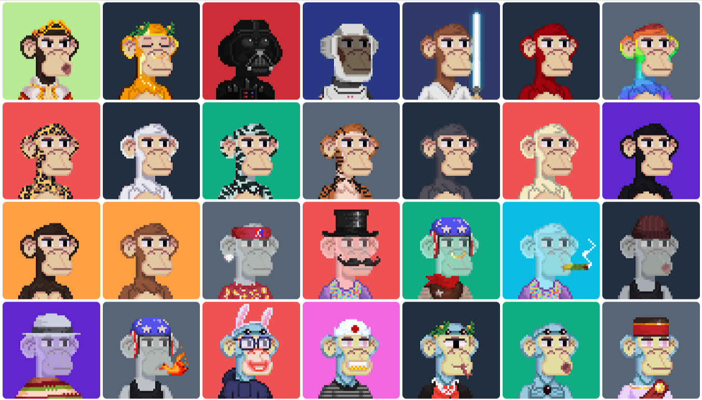

# Ape Gang

## Ape Gang is a collection of 8,200 NFTs minted on the Ethereum blockchain in June 2021

All Ape Gang NFTs were algorithmically generated from 156 hand drawn traits using python. The pixel art style uses a 50x50 pixel format, a style which [Jokong](broken-reference), the founder and artist, is renowned for.

### Ape Gang NFTs passively yield 1 $GANG per day

* [$GANG](../the-ecosystem/usdgang-token.md) is our ERC-20 token which fuels the Ape Gang ecosystem.
* Yield can be increased to 1.25 $GANG per day if you burn a [Toucan Gang NFT](toucan-gang.md).
* There are multiple [utilities](../the-ecosystem/utilities.md) already available for you to spend $GANG on.

### Use your Ape in our P2E game Fight Club

[Fight Club](../play-to-earn/fight-club.md) is a 1v1 game where you can fight your Ape Gang NFT against other community member's Apes to climb the leaderboard and win $GANG.

All you need is an Ape Gang NFT and a browser to play.

### Built-in fighting stats

Every Ape has 4 built-in on-chain stats. Strength, Health, Fail % and Critical %. Together these stats determine overall fighting ability.

All 156 traits influence fighting stats. But which traits are good for fighting?

* **Fur Type** is the most influential trait when it comes to fighting. Fur type determines the baseline strength, health, fail % and critical %.
* **Clothing** traits add between 6 to 10 strength. Apes with no clothes therefore have considerably lower strength.
* **Hat** traits add between 10 to 15 extra health points.
* **Eye** traits improve the chance of hitting a critical attack because the Ape has better vision.
* **Mouth** traits improve the fail %, making the Ape less likely to miss an attack.
* **Ear** traits add 5 health points and improve the fail % and critical % by 1.

_Read the_ [_full breakdown of stats_](../faqs/what-are-the-individual-traits-fighting-stats.md) _if you would like to know more about fighting stats._

### Fur type passive abilities

Every Ape has a passive ability associated with their fur type

<table><thead><tr><th width="203">Fur Type</th><th>Passive Ability</th></tr></thead><tbody><tr><td>Brown</td><td>Each turn has a 1/10 chance of not receiving damage from the enemy</td></tr><tr><td>Strong Dark Brown</td><td>Each turn has a 1/100 chance to kill the enemy in one shot</td></tr><tr><td>Black</td><td>1/3 chance to multiply strength by 2 for this turn only</td></tr><tr><td>Cream</td><td>1/4 chance to increase the enemy % fail by 45 only for one turn</td></tr><tr><td>Grey</td><td>1/2 chance to gain 40 critical % for this turn only</td></tr><tr><td>Tiger</td><td>1/4 chance of stealing 3 strength points from the enemy</td></tr><tr><td>Zebra</td><td>1/2 chance of stealing 2 critical % from the enemy</td></tr><tr><td>White</td><td>1/6 chance of stealing 3 health points from the enemy</td></tr><tr><td>Cheetah</td><td>1/2 chance to increase the enemy % fail by 3</td></tr><tr><td>Rainbow</td><td>1/3 chance to gain 9 strength points</td></tr><tr><td>Red Devil</td><td>Critical damage multiplied by 2 instead of 1.5</td></tr><tr><td>Robot</td><td>1/2 chance to gain 3 critical %</td></tr><tr><td>Zombie</td><td>30% of the damage the enemy inflicts on you is returned to him each turn</td></tr><tr><td>Alien</td><td>1/5 chance to divide the enemy's damage by 2 on the next attack</td></tr><tr><td>Ghost</td><td>Once dead, comes back to life with 1 health point</td></tr></tbody></table>

### Access to the Ape City metaverse

Owning an Ape Gang gets you access to our custom 3D island with skyscrapers and jungles. Explore the world in online multiplayer with the community. All you need to get into the [Ape City metaverse](../the-ecosystem/ape-city-3d-metaverse.md) is an Ape Gang NFT and a browser.

Your unique Ape and it's traits will automatically be generated as your playable character for the metaverse.

### Ape rarity

Some people buy Apes for aesthetics, some for their fighting ability and some for the rarity.&#x20;

But which Apes are rare? You can search through the whole collection on [Rarity.Tools](https://rarity.tools/ape-gang) to find a rare Ape that suits you. And if you're lucky maybe even a rare Ape that has been mis-priced.

<figure><figcaption>
The rarest Apes
</figcaption></figure>

### Full commercial usage rights

Holders will always have full commercial usage rights over their Ape Gang NFTs.
