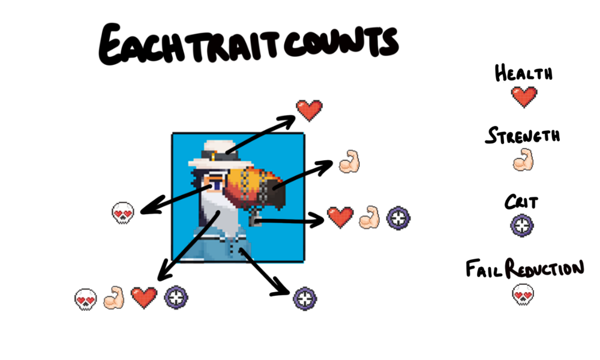

# Toucan Gang

## Toucan Gang is a deflationary NFT companion collection

Each Toucan Gang NFT was programmatically generated from 150 unique traits using python. All 150 traits were hand drawn by [Jokong](../about-us/founders.md) using a 50x50 pixel format.

Holders will always have full commercial usage rights over their NFT

### Toucans have two main utilities

1. Burn your Toucan to increase your daily $GANG yield OR
2. Pair your Toucan with an Ape to improve its fighting stats for [Gang Wars](../play-to-earn-games/gang-wars.md) Season 2

The constant burning of Toucans reduces the total supply permanently, meaning this collection is deflationary

## If you burn your Toucan 

Burning a Toucan will increase the $GANG yielding of one Ape Gang NFT by 25% for all eternity. So, after burning one Toucan, your Ape will yield 1.25 $GANG per day instead of 1 $GANG per day.

Read [how to burn your Toucan](../faqs/how-do-i-burn-my-toucans.md)

## If you don’t burn your Toucan 

Toucans will boost Ape stats in Gang Wars Season 2. We will be introducing several new features in our next season. Season 2 will be a fast-paced 5 Ape vs 5 Ape mobile game where up to 5 Toucans can be played to boost the stats of your apes. Two Toucan booster slots are available from the beginning for all players and the remaining three slots are unlocked as you progress in the game.

## How do Toucan traits influence their stats? 

Toucans stats are based on their plumage and their combination of traits. As a general rule of thumb, the rarer a Toucan is, the better its stats will be. Individual Toucan stats can be viewed on [OpenSea](https://opensea.io/collection/toucan-gang).

* Plumage provides a background stat to: health, strength, critical damage and fail
* Hats boost health
* Beaks boost strength because Toucans use their beaks to inflict damage
* Accessories boost health, strength, and critical damage due to their rarity
* Clothes boost critical damage
* Eyes **** reduce the **** chance of failure because of increased vision

## How do Toucan stats boost Ape stats? 

When you select a Toucan to boost one of your Apes, the Toucan’s values will be added to your Ape’s values. To avoid confusion, if your Toucan’s fail stat is negative it will be _subtracted_ from your Ape’s fail stat.

For example, if your Ape has 400 health and you boost it with a 65 health Toucan, your Ape will have 465 health after the boost.

So how should you go about selecting the best Toucans to boost your gang? We will leave this entirely up to you. Maybe you decide to lower your Robot Ape’s chance of failing. Or increase the critical chance for your Red Devil Ape. Who knows. Have fun experimenting!

#### Fun Fact: The inspiration for Toucan Gang came from Jokong's pet parrot called Riggs
