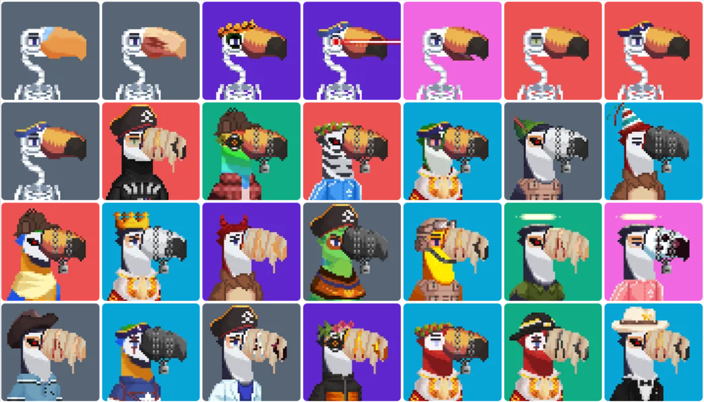

# Toucan Gang

## A deflationary NFT companion collection

All 7,815 Toucan Gang NFTs were programmatically generated from 148 unique traits using python. The traits were hand drawn by [Jokong](../about-us/founders.md) using a 50x50 pixel format.

Toucan Gang was a free mint in October 2021 for all Ape Gang holders.

### Toucans have two main utilities

1. Burn your Toucan to increase your daily $GANG yield OR
2. Pair your Toucan with an Ape to improve its fighting stats for [Gang Wars](../play-to-earn-games/gang-wars.md) Season 2.

The constant burning of Toucans reduces the total supply permanently, making the collection deflationary. So far 1,115 Toucans have been burned.

## If you burn your Toucan 

Burning a Toucan will increase the $GANG yielding of one Ape Gang NFT by 25% forever, even if the Ape is sold. So, after burning one Toucan, your Ape will yield 1.25 $GANG per day instead of 1 $GANG per day.

Read [how to burn your Toucan](../faqs/how-do-i-burn-my-toucans.md).

## If you don’t burn your Toucan 

Toucans will boost Ape stats in Gang Wars Season 2. We will be introducing several new features in our next season. Season 2 will be a fast-paced 5 Ape vs 5 Ape mobile game where up to 5 Toucans can be played to boost the stats of your apes. Two Toucan booster slots are available from the beginning for all players and the remaining three slots are unlocked as you progress in the game.

## How do Toucan traits influence their stats? 

Toucans stats are based on their plumage and their combination of traits. As a general rule of thumb, the rarer a Toucan is, the better its stats will be. Individual Toucan stats can be viewed on [OpenSea](https://opensea.io/collection/toucan-gang).

* Plumage provides a background stat to: health, strength, critical damage and fail.
* Hats boost health.
* Beaks boost strength because Toucans use their beaks to inflict damage.
* Accessories boost health, strength, and critical damage due to their rarity.
* Clothes boost critical damage.
* Eyes **** reduce the **** chance of failure because of increased vision.

_Read the_ [_full breakdown of stats_](../faqs/which-toucan-traits-are-good-for-fighting.md) _if you would like to know more about Toucan fighting stats._

## How do Toucan stats boost Ape stats? 

When you select a Toucan to boost one of your Apes, the Toucan’s values will be added to your Ape’s values. To avoid confusion, if your Toucan’s fail stat is negative it will be _subtracted_ from your Ape’s fail stat.

For example, if your Ape has 400 health and you boost it with a 65 health Toucan, your Ape will have 465 health after the boost.

So how should you go about selecting the best Toucans to boost your gang? We will leave this entirely up to you. Maybe you decide to lower your Robot Ape’s chance of failing. Or increase the critical chance for your Red Devil Ape. Who knows. Have fun experimenting!

## Toucan rarity

Some people buy Toucans for aesthetics, some for their fighting stats, some just buy a cheap one to burn it for extra [$GANG](../the-ecosystem/usdgang-token.md), and some people go for the rare Toucans.&#x20;

But which Toucans are rare? You can search through the whole collection on [Rarity.Tools](https://rarity.tools/toucan-gang) to find a rare Toucan that suits you. And if you're lucky maybe even a rare Toucan that has been mis-priced.

<figure><figcaption>
The rarest Toucans
</figcaption></figure>

## Why are there 7,815 Toucans?

Toucan Gang was a free mint for Ape holders with a mint window of 10 days between October 20th and October 30th 2021. For every Ape held in your wallet you could mint a Toucan. Not all 10,000 potential Toucans were minted. Likely due to a combination of holders not being aware and some people losing access to their wallets. And that's how we ended up with 7,815 Toucans.

## Full commercial usage rights

Ape Gang provides, and will always provide, full commercial usage rights to the individual who owns a Toucan Gang NFT. Only the specific Toucan Gang NFT(s) which are owned may be used commercially. Usage includes, but is not limited to, product branding, monetising your personal brand image and both film and music productions. With the exception of using a Toucan Gang NFT to promote any form of hate speech or criminal activity.

#### Fun Fact: The inspiration for Toucan Gang came from Jokong's pet parrot called Riggs.
