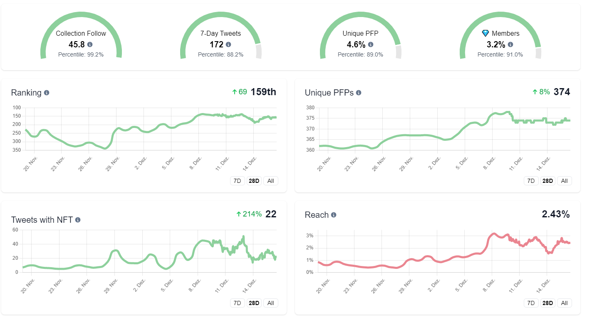
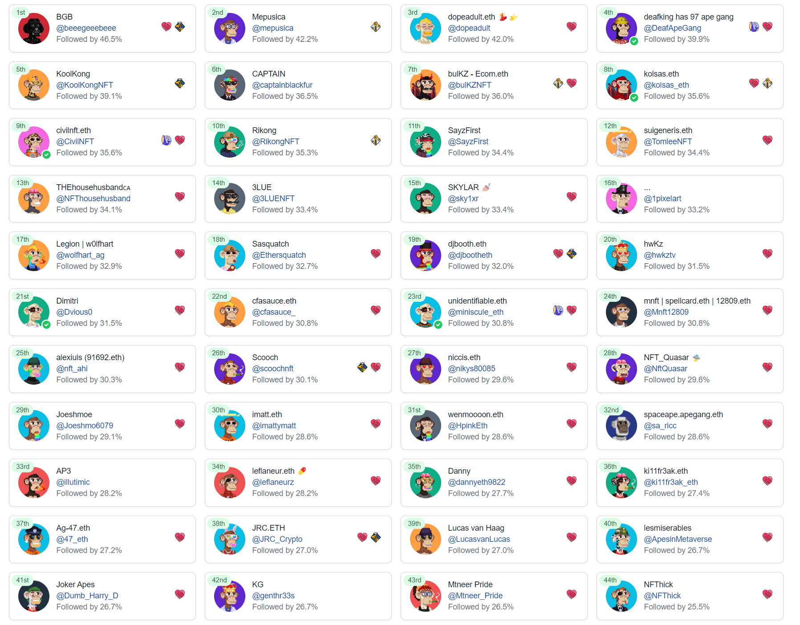
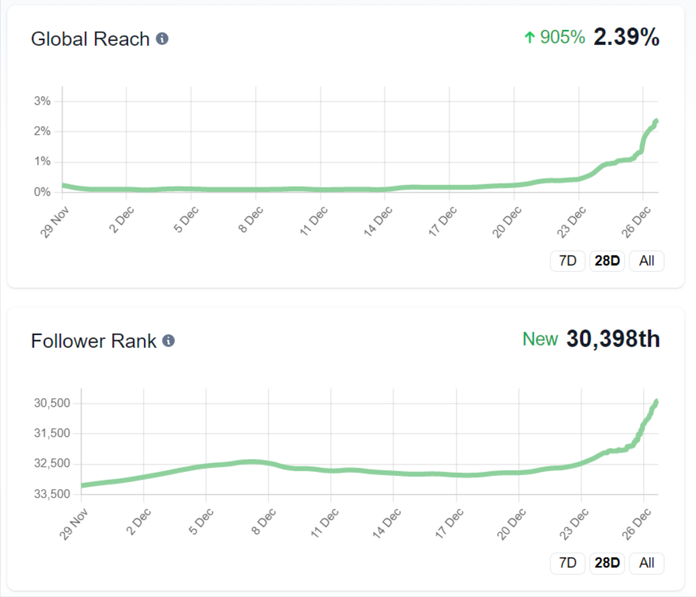

# Ape Academy

## Tips and Tricks for Twitter growth

After 1.5 years on Twitter we've learnt the best ways to grow! And now Kool-Kong is sharing those tips with holders in one neat place where it's easy to follow. We'll help you grow on average 20-50 followers a day.

#### Ape Academy has guided 12 members to over 5,000 followers already!

## How to join:

1. Own an Ape Gang NFT
2. Join the [Discord](https://discord.gg/ape-gang-841359732786331658) and verify your NFT
3. Go to the #Ape-Academy channel and follow along!
4. Have an Ape Gang pfp on Twitter

<figure><figcaption>
Get personalised stats and advice
</figcaption></figure>

 

<figure><figcaption>
See how everyone is progressing
</figcaption></figure>

 

<figure><figcaption>
Deep analysis of your followers
</figcaption></figure>

 

<figure><figcaption>
Start to grow your Twitter
</figcaption></figure>

