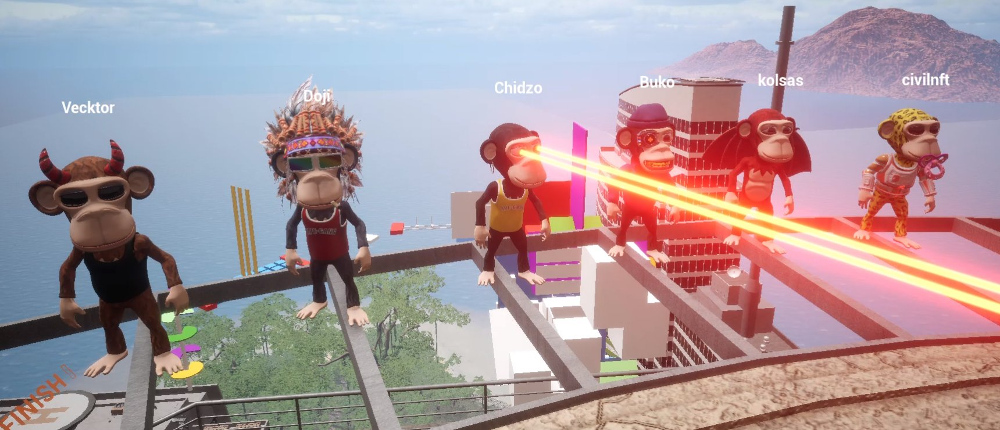

# Ape City 3D Metaverse

## Our custom 3D island with skyscrapers and jungles to explore

All you need to get into the Ape City metaverse is an Ape Gang NFT and a browser.

Sign in to our metaverse [here](https://leapn.life/ape-gang/ape-city/).

#### Your unique Ape and it's traits will automatically be generated as your playable character for the metaverse

### The Ape City obstacle course

We have a challenging obstacle course floating in the sky above the city. There are 4 checkpoints along the route in case you fall from one of the many moving elements. Give it your best!&#x20;

Follow the signposts at street level to access the course.

### Leapn

Leapn is the team behind our metaverse. They created the island and designed all the assets following Ape Gang's direction. Find out more about the team behind our metaverse on [leapn.life](https://leapn.life/).
