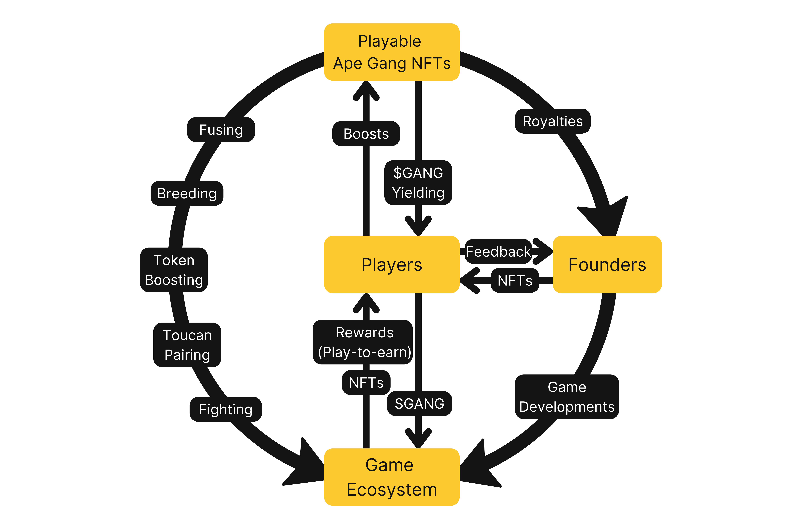
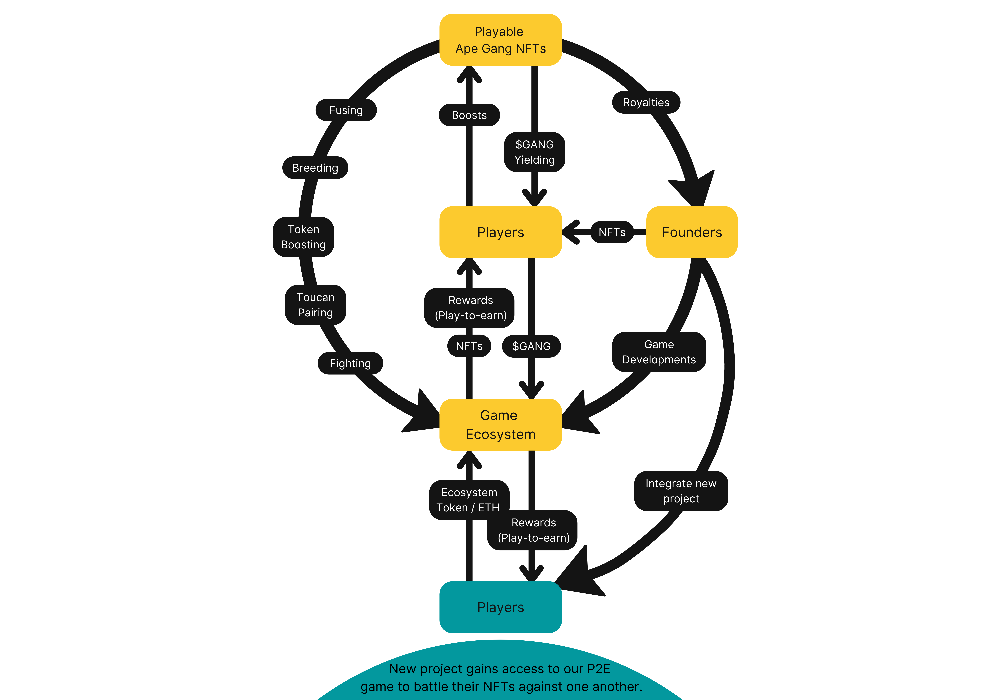

# Ape Gang Ecosystem

## A Web3 gaming ecosystem

What is Web3 Gaming?

Web3 gaming is a gaming model where people can own and trade in-game collectibles in the form of NFTs using cryptocurrencies.

Web3 gaming is a process of decentralized gaming where the activities of a gaming ecosystem or a gaming platform, specifically that of the ownership of gaming assets and decision-making in all aspects of gaming, are delegated away from any central authority.

Web3 games are built by integrating blockchain into the gaming ecosystem, allowing gamers to express their opinion on when and how the game should evolve. Web3 gaming also lays down the foundation of play-to-earn for players, and it changes the pay-to-play aspect by offering asset trading, tradeable game tokens and opportunities to earn in cryptos while playing. &#x20;

Web3 gaming provides fair virtual markets for the gaming industry, where players can access and fully own in-game digital assets. These assets are stored in the form of gaming NFTs and are distinctive.

Apes, Toucans, Jaguars, $GANG and our P2E game fit seamlessly into our Web3 ecosystem.

<figure><figcaption>
An ecosystem which centres around the players
</figcaption></figure>

## Ownership

Web3 gaming offers self-sovereignty where players can completely own in-game assets as NFTs. In traditional gaming, players own in-game assets and collectibles, but they lose all of their assets once they decide to change the gaming platform. Web3 gaming solves this problem by providing true ownership and interoperability between various platforms. The players can own in-game assets on one platform and carry them over to their next gaming platform. For us this means owning an Ape Gang NFT enables you to play [Fight Club](../play-to-earn-games/fight-club/) on our platform or Battle Showdown on [Ethlas](../about-us/partnerships.md#ethlas-metaverse)' platform, and in the future more gaming platforms.

## Player-driven gaming

Web3 gaming tailors the gaming ecosystem based on players’ liking. There are different ways in which Web3 gaming benefits players. One is the play-to-earn aspect, where players earn profit via their in-game items. Another aspect of player-driven gaming is that the players are the ones who choose how the game is developed. In Ape Gang the players feedback to the [Founders](../about-us/founders.md) who then tailor the game to how the community desires.

## Transparent gaming

Web3 gaming NFT assets are stored on the blockchain, making them unhackable. This means that the fighting stats of Apes, Jaguars and Toucans are visible for everyone to see on the blockchain. This way, Web3 gaming ensures a high level of transparency.&#x20;

## How does it all work?

The players and their [Apes](../nft-collections/ape-gang.md) are the centre piece. They yield [$GANG](usdgang-token.md) which fuels the whole ecosystem and compete in the P2E game Fight Club.

[Toucans](../nft-collections/toucan-gang.md) can be used two ways; to boost Apes' P2E fighting stats OR to boost Apes' $GANG yielding.

[Jaguars](../nft-collections/jaguar-gang.md) have multiple utilities. They add a new dynamic to the world with our innovative genetic-based breeding and fusing which creates new NFTs. They are also able to compete against Apes in [Fight Club](../play-to-earn-games/fight-club/).

Together, our three NFT collections combine to fight against each other in our play-to-earn game [Fight Club](../play-to-earn-games/fight-club/) to earn [$GANG](usdgang-token.md).

## How could it look in the future?

<figure><figcaption>
Fight Club is scalable and ready to integrate new NFT collections
</figcaption></figure>
