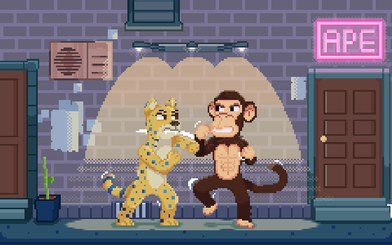

# Lore

## Preface 

All is not well in Ape City.

It’s 2022 and the humans are once again encroaching on the outskirts of our territories. The new generation of apes has become complacent having spent their lives in abundance. Now, it is once again time for us to protect what we have built.

Who am I, you may ask? My name is Bozo, The Simian Ape Gang Scientist, and I shall be your narrator as we journey along this tale of how tree-dwelling apes overcame hardship and became modern 21st-century apes despite fierce opposition from the humans.

## Chapter 1: The Origins anno 1953&#x20;

So, let’s take you back to the origins of where we came from and why we are here now. Our tribe of apes used to be simple creatures living undisturbed in the deepest parts of the jungle, minding our business and living as free as we could. Our days passed swinging from tree to tree without a care in life. Then on an autumn day in 1953, one of our ancestors stumbled across an ancient portal hidden from plain sight in a rarely visited part of the jungle. The portal gave us access to a new world rich in ganganite — a rare-earth mineral with the power to accelerate evolution. Those of us who migrated across to the new world rapidly evolved a sense of identity and built complex communities, and a way of life that we truly cherished.

Every day, the tribe would gather their harvesting equipment and set off on their jaguars into the jungle to see what they could bring home. They used toucans as guides, who could soar above the jungle canopy and spot the ganganite assets the apes so desperately needed to accelerate the growth of their ecosystem.

Our ancestors evolved with help from their ganganite gains and grew stronger and more intelligent by the year. They developed their personalities and forms and could carve a new path as modern apes in our space. However, only 20 years later, a strange beast appeared on one of our hunts. It was eating trees and unearthing the land beneath its feet. We had never seen a thing of such magnitude and destruction before; it was horrific and needed to be stopped. There came with it, strange-looking creatures; they were like shaved apes but wore a strange wrapping on their bodies. These were “The Humans”.

They made many noises and shouted things like “Just kill it”, “Burn it down”, and “Grab that ganganite”. Such sentences were new to our vocabulary.

Collectively, we got our simian minds together and decided we needed to study these odd beasts and figure out what motivated their madness.

## Chapter 2: The Toucan Blaze anno 1979

Over the years, more of the tree killing machines appeared, with more of these humans, and more and more of our home faded away. We learned that humans craved ganganite more than anything and were using it to build their own currency.

We decided enough was enough; something had to be done. So, we put our brightest ape minds into a deep state of thought to come up with a plan of attack. Natural leaders emerged, and the core team was formed from Ape Lincoln, Jo, Ri, and Kong.

Their master plan was to overthrow the humans by any means necessary. So, with the apes began a wave of espionage and acquisition of “human items’’ using the very same $GANG they so desperately craved. Initially, these items allowed the apes to slip in and amongst the humans and take their form for enough time to learn their ways. After a few weeks of studying these tree-killing bastards, Ri had a great idea to use our dear Toucan companions to lure the humans away from their equipment, long enough for the apes to jump in and take control.

As you know, since ancient times, we’ve been connected to Toucans in so many ways. But many of them had since been enslaved by our enemies and forced to do their ill-bidding. We had previously tried to free the caged toucans but were unsuccessful.

In a rare moment of clarity, Jo had recalled an ancient proverb by the great Toucan elder that reads:

> _By burning the toucans, they would be released from their mortal shell, and reborn to once again fly free._

So, on January 24th 1979, we decided to put words to action. Sheltered from the darkness, Jo, Ri, and Kong snuck into the human encampment, located one of our enslaved Toucans and set it ablaze. The Toucan screeched “Thank you” and, in a blaze of glory, turned into a flame so bright the whole jungle was lit up. The soul of the Toucan was once again able to fly free and be at peace away from the Humans.

As the Toucan flew away, it shed its scorched shell, which turned to ganganite in its purest form as it hit the jungle floor. We use this blessing to further our development as an evolved species of apes, protecting our jungle from the encroaching onslaught of human intervention.

This explosion of light terrified the humans, scaring them off, incapacitating their tree-eating beastly machines and allowing us to once more return to our homes. But not for long! It was only a few moons before they were back. And this time, they were here for us!

They came in the night, taking the weakest of our species. Thankfully, some of us escaped and disappeared into the jungle on the backs of our Jaguars, where we were forced to sit and watch as the last remaining pieces of our civilization crumbled at the hands of the humans. All we had left were our remaining ganganite bags, Jaguars, a squadron of Toucans, and each other.

Oh, and a weight of human clothing, weapons, and even a strange thing the humans referred to as “music”.

So, we tooled up and decided to encroach on the space the humans called their own. We decided to regroup and prepare for taking over their city and making it our own.

## Chapter 3: **The Great Division of Apes anno 1982**

The idea was to require the remaining 10,000 apes in the tribe to be brave and attack the human city, destroying their homes. Many Apes in the tribe spoke of ideas like partnering with the humans, cutting off their food supply, and even killing them. Ape Lincoln, Jo, Ri, and Kong sat down and decided what needed to be done. Clearly outnumbered, we needed to develop a new means of warfare based on tactics including ambush, hit-and-run, and mobility.

Ape Lincoln wanted to go down the route of a partnership with the humans and felt that there was a more diplomatic way to live together. As one of the most intelligent Apes in the jungle, he quickly became one of the prominent leaders, amassing a large following. Some say he was so sophisticated; he could even pass as a human and often practised walking upright amongst his peers, without so much as a second glance from those who knew his reasons. But here is where things start getting complicated.

On a cold November day, Jo confronted Ape Lincoln out of the blue with annoyance in his breath. Jo was also an intelligent ape and didn’t exactly love the idea of cozying up with the humans that were destroying his home. He felt a little payback was in order, so he made plans with a couple of the other Apes to cut off the human’s primary food sources (specifically the farms surrounding the city) and eventually starve them out. This seemed like a brilliant idea and could also benefit the hungry bellies of the Apes that had been hungry for years.

But no one had seen the incandescent rage that had taken over Kong, who, until now, had stayed silent. There’s one thing you need to know about Kong, he’s a mean ape with nothing but vengeance in his heart, but don’t tell him I said that.

His plan was simple: kill every human that refused to leave the city. Simply put, a bloodbath at the hands of the Apes, sparing the ones that we’re smart enough to run and punishing the ones that stood their ground.

Kong felt that the other ideas were too soft for him and that the humans would never learn their lesson. This caused quite an argument between Ape Lincoln, Jo, and Kong, and a scuffle broke out. No one knows exactly what happened next but, in the scuffle, Kong was fatally injured and Jo and Ri decided in an instant to carry on Kong’s legacy by taking his name. Enraged by Kong’s passing, the apes now known as Jokong and Rikong independently ganged up and decided to attack the city with one thing in mind, absolute domination.

Knowing he had no choice, Ape Lincoln tagged along with a hidden agenda to ensure no-one, human nor ape, was harmed…

## Chapter 4: The Takeover anno 1982

All with numerous apes by their sides, Jokong, Rikong, and Ape Lincoln poured into the city. Ape Lincoln tapped into the human communication channels and started spreading propaganda warning of the attack and urging the humans to surrender peacefully or flee. He later settled in one of the more civilized districts taking it as his own with the humans, overall, accepting their new cohabitants.

Rikong took control of the farms, holding parts of the city under siege, and Jokong went straight for the $GANG treasury. Meanwhile, Kong’s crew — in an act of confusion without the guidance of their leader — tore through the upper districts only to find a ghost town abandoned by humans who had chosen to heed Ape Lincoln’s advice.

After very little resistance and no bloodshed, the humans eventually relinquished control of the city to the apes. But there was a new problem arising. New gangs were forming across the city, all with opposing leaders — not just Ape Lincoln, Jokong, and Rikong but apes from across the world coming to stake their claim to the abandoned utopia now named Ape City.

Kong’s old gang, now led by Don V, are the brutes of the city, forming the Ape Mafia gang that terrorizes neighbors and strikes fear into anyone who even thinks about attacking them. Then there is BGB; he and his stylish buddies control the entertainment districts, so they have a lot of power over the other gangs and became nicknamed the Sessy gang for apparent reasons.

And what about Ape Lincoln, I hear you ask? Well, he serves as the perfect example of why apes have got to be both strong and smart in this new world. He held his district for a time, protecting the humans residing within, but with resources spread thin and too few apes by his side, an enemy gang from the far side of the city attacked, forcing Lincoln to flee into the sewers. Still, he awaits the moment where he can emerge and take control once more.

But there are more gangs, many more. Ones that use wacky technologies, ones with strange mutations, and some who just like to party.

## Chapter 5: The Gang Wars anno 1993

Over time allegiances were built, and gangs evolved, but too many tried to be victorious and rivalry was getting out of control. Ape City was teeming with sin and apes, like BGB, were amassing fortunes through degenerate secretive activities.

On November 1st 1993, the strongest Gang Leaders decided to convene a Leaders Council and discuss the fate of Ape City. They voted to build a fortified $GANG treasury for gangs wanting to protect their wealth. Knowing that apes will be apes, the Leaders Council developed Gang Wars as a means to distribute scarce resources amongst the strongest gangs. They also decided to start supporting worthy causes to help restore & rebuild environments damaged by the humans.

The winning gangs are granted access to Ape City’s treasury and first pick of trusted jaguar companions. Apes use jaguars to help their next level of evolutionary prowess. Jaguars can be used for fusing and breeding, allowing apes to have strong feline allies in their ongoing battles with the opposing gangs. The exceptionally victorious few will create [Legendary Jaguars](https://opensea.io/collection/jaguar-gang) and breed [Legendary Cubs](https://opensea.io/collection/jaguar-gang). Thus, expanding the strength of their gang’s arsenal and accumulating more precious resources.

Over time, Gang Wars became somewhat of a regular event in Ape City. Picture a weird kind of Olympics with all-out warfare between rival gangs, fielding battle-ready apes, toucans, and jaguars - collated by capability and traits - and led by intrepid Gang Leaders.

## Chapter 6: The Future

The year is 2022. Ape City has prospered in times of peace and the streets are overflowing with $GANG. But all is not well. Myself, Bozo, and the now grey-haired leaders Ape Lincoln, Jokong, and Rikong have noticed a shift in human activity surrounding Ape City. They are once again encroaching on the outskirts of our territories.

But Ape City’s biggest threat comes from within. The new generation of apes has grown complacent after years of living in abundance. And their newfound riches are diminishing their allegiance to Ape City. Only a few devoted young bloods remain. The likes of Lulu, Kong Junior, and Brigitte. Across the board, ape values and culture are fading into oblivion.

Hence, the Leaders Council has embarked on a mission to consolidate the support of the remaining active inhabitants of Ape City and circumvent any future conflicts with the humans. We have allocated a huge chunk of our treasury to integrate ape values & culture into the core of Human Society. Future conflict can only be avoided if apes succeed in becoming a valuable part of the everyday life of humans. Be it fashion, music, gaming, and social interaction, humans will crave anything ape. How are we going to achieve this?

#### Fight Club is the answer 

In [Fight Club](https://apegang.art/fight) there’s no hiding behind the strength of your gang. This is 1 vs 1 at its best. Squaring off against an opponent, be it human or ape, lays the foundation for mutual respect and acknowledgement of cultural differences.

* 1st Rule: You do not talk about Fight Club.&#x20;
* 2nd Rule: You DO NOT talk about Fight Club, but you should tweet about it.&#x20;
* 3rd Rule: If you get REKT don't cry.
* 4th Rule: Only two apes to a fight.
* 5th Rule: One fight at a time but 12 per day.&#x20;
* 6th Rule: No shirts, no shoes, but tails allowed.&#x20;
* 7th Rule: Fights will go on as long as they have to, but each week lasts 5 days.&#x20;
* 8th Rule: If this is your first night at Fight Club, you HAVE to fight.

#### **Big changes are coming to Ape City** 

Overproduction of $GANG could be a thing of the past

Ape City is overflowing with $GANG but with fewer apes around there comes a time when it’s no longer prudent to continue producing $GANG from ganganite. The Leaders Council is closely monitoring the financial state of Ape City and is ready to take action sooner than later.

#### The times of exuberant building have passed 

For many years the Leaders Council adopted a “Build, Build, Build” approach to keep Ape City relevant in an increasingly complex world. Given the current situation, and having already successfully built a strong foundation for future growth, the Leaders Council has wisely chosen to consolidate & prioritize efforts around initiatives that bring the most value to Ape City and its $GANG economy.

## Chapter 7: The Threat From Within

Throughout time, the history of Ape City has been shaped by the conflict between Apes and Humans. We left off with Ape City facing a generational crisis with an abundance of $GANG putting our values and culture on the line. Instead of Humans, the biggest threat came from within. My name is Bozo and I…….&#x20;

> \*Commotion, loud screams and deep growling\*
>
> Wait! What’s going on? Why are you doing this? I thought we had an understanding.&#x20;

Listen up Ape City! My name is J. L. Rover and I represent the Jaguars. We have always enjoyed living alongside apes, but enough is enough. Apes have hoarded the riches found within __ the Ganganite ore and most importantly you have lost sight of the values we all used to share back in the good years of Ape City.&#x20;

We Jaguars now demand a fair share of the riches you have selfishly amassed. We want something better for our little ones and now that we’ve gained strength through fusing, we have decided to challenge apes for the leadership of Ape City.&#x20;

We believe in the old ways of giving control to the strongest and most worthy. So, instead of all out warfare, which would lay destruction to our beloved city, we have taken control over the $GANG treasury and removed power from the Leader’s Council.&#x20;

<figure><figcaption>
<em>Jaguars vs Apes</em>
</figcaption></figure>

If apes want a shot of regaining control of Ape City they will have to prove themselves in Fight Club and Gang Wars.
