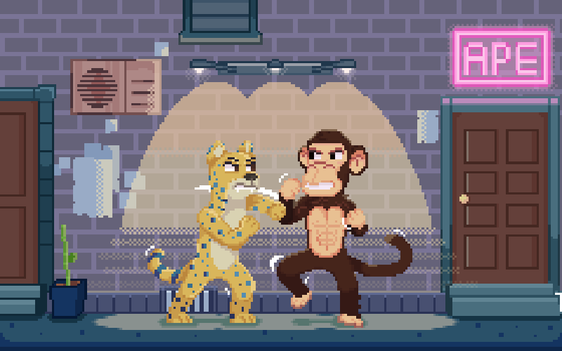

# Chapter 7

## Chapter 7: The Threat From Within

_Something new is coming..._

Throughout time, the history of Ape City has been shaped by the conflict between Apes and Humans. We left off with Ape City facing a generational crisis with an abundance of $GANG putting our values and culture on the line. Instead of Humans, the biggest threat came from within. My name is Bozo and I…….&#x20;

> Wait! What’s going on? Why are you doing this? I thought we had an understanding. (edit: commotion, loud screams and deep growling)

Listen up Ape City! My name is J. L. Rover and I represent the Jaguars. We have always enjoyed living alongside apes, but enough is enough. Apes have hoarded the riches found within _the_ Ganganite ore and most importantly you have lost sight of the values we all used to share back in the good years of Ape City.&#x20;

We Jaguars now demand a fair share of the riches you have selfishly amassed. We want something better for our little ones and now that we’ve gained strength through fusing, we have decided to challenge apes for the leadership of Ape City.&#x20;

We believe in the old ways of giving control to the strongest and most worthy. So, instead of all out warfare, which would lay destruction to our beloved city, we have taken control over the $GANG treasury and removed power from the Leader’s Council.&#x20;

<figure><figcaption>
<em>Jaguars vs Apes</em>
</figcaption></figure>

If apes want a shot of regaining control of Ape City they will have to prove themselves in Fight Club and Gang Wars.
