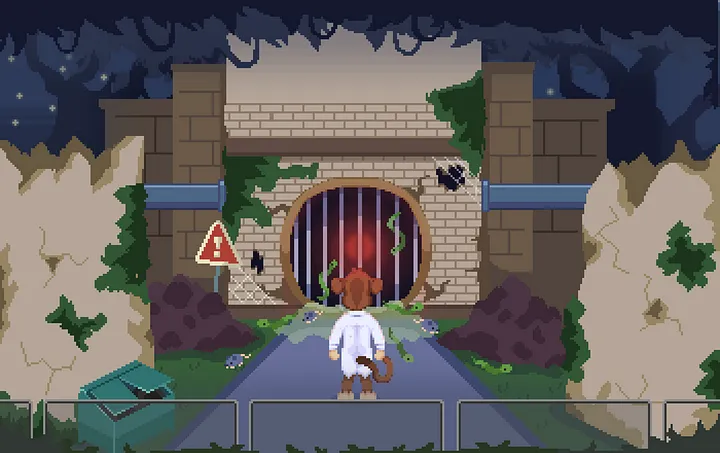

# Chapter 9

## Chapter 9: Late night strolls and red pulsating lights

Every Ape knows The Scientist but The Scientist doesn’t know every ape. This is not a deliberate choice but rather a consequence of his dedication to scientific research. When you’ve been spending every waking hour developing cures for paperhanditis and shiny object syndrome, personal relations naturally come second.

<figure><figcaption>
The Scientist ape stumbled upon a sewer entrance with a faint red glow from deep within
</figcaption></figure>

That being said, The Scientist wasn’t oblivious to the changes to Ape City after the coup by J.L. Rover and his Jaguar posse. It just didn’t bother him too much. Jaguars only harassed strong apes and The Scientist had never partaken in anything resembling a fight. Except for trolling flat-earthers and conspiracy theorists on Twatter; the preferred social media platform for pretty much anyone in Ape City and surrounding cities. But that’s a different story altogether.

The Scientist had few interests besides — well — science. One of them being late night strolls through deserted streets of Ape City to clear his mind and let the creative juices flow.

On one such stroll he suddenly heard the faint echoes of a loud commotion coming from deep within an uninhabited & derelict part of Ape City known amongst Apes as Kong’s Betrayal.

Inquisitive by nature, The Scientist followed the sound through abandoned buildings and hidden alleyways and — finally — stumbled across an altogether incredible spectacle: a swarm of critters fleeing from a seemingly abandoned sewer outlet.

_As he came closer he noticed faint pulsating red lights emanating from the outlet and felt a sudden urge to crawl inside…._
