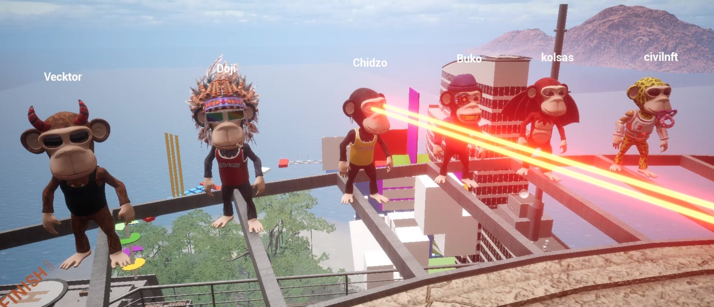

# Metaverse

## Our custom 3D island with skyscrapers and jungles to explore

Owning an Ape Gang gets you access to our metaverse. Discover the island in online multiplayer with the rest of the community. All you need to get into the Ape City metaverse is an Ape Gang NFT and a browser.

Sign in to our metaverse [here](https://leapn.life/ape-gang/ape-city/).

#### Your unique Ape and it's traits will automatically be generated as your playable character for the metaverse

### The Ape City obstacle course

We have a challenging obstacle course floating in the sky above the city. There are 4 checkpoints along the route in case you fall from one of the many moving elements. Give it your best!&#x20;

Follow the signposts at street level to access the course.

### Leapn

Leapn is the team behind our metaverse. They created the island and designed all the assets following Ape Gang's direction. Find out more about the team behind our metaverse on [leapn.life](https://leapn.life/).

## Sandbox

Ape Gang also owns land [(-41, 161)](https://opensea.io/assets/ethereum/0x5cc5b05a8a13e3fbdb0bb9fccd98d38e50f90c38/149083) in the Sandbox metaverse which is nearby the RTFKT land.

Sandbox has not impressed us with their speed of development, and at present there is not much intractability or utility within Sandbox. Regardless, we have decided to diversify our metaverse acquisitions to cover the Sandbox as it still has a good chance of success.&#x20;

To supplement this Ape Gang has already created a full NFT collection of Sandbox ready characters, known as voxels. These voxels are finished and ready to use in the Sandbox metaverse, but will only be released when the time is right, and when Sandbox has progressed further.

### WorldWideWeb3

Ape Gang was also integrated into the WWW3 metaverse back in November 2021.
